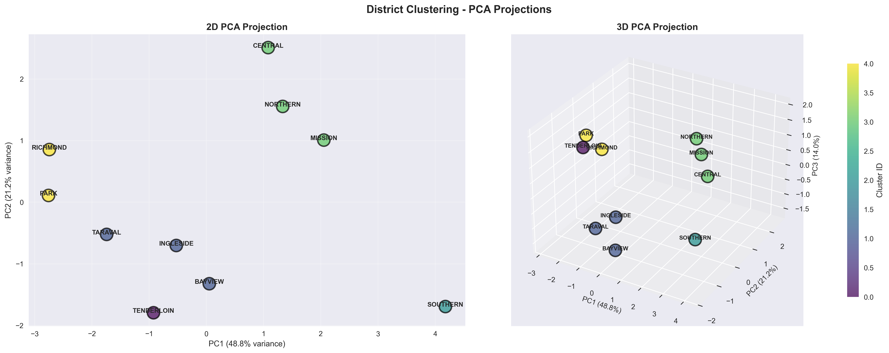
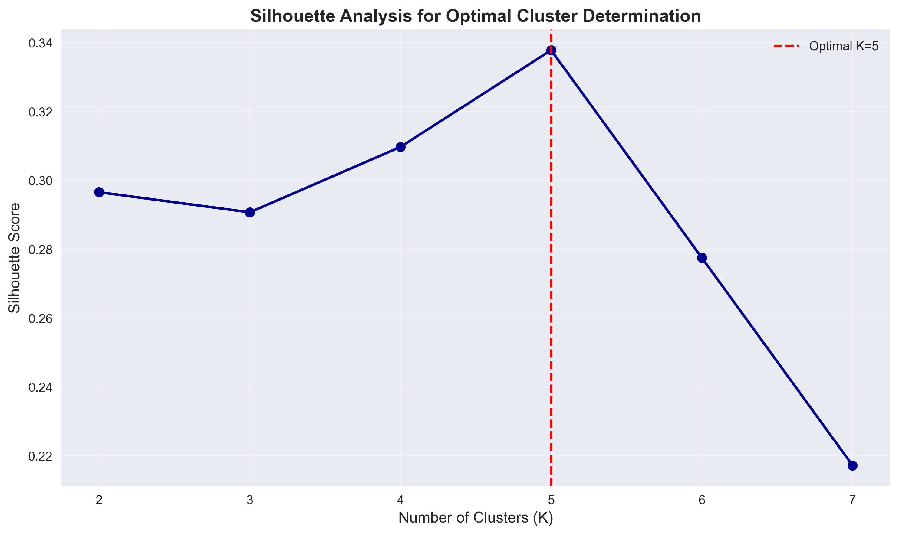
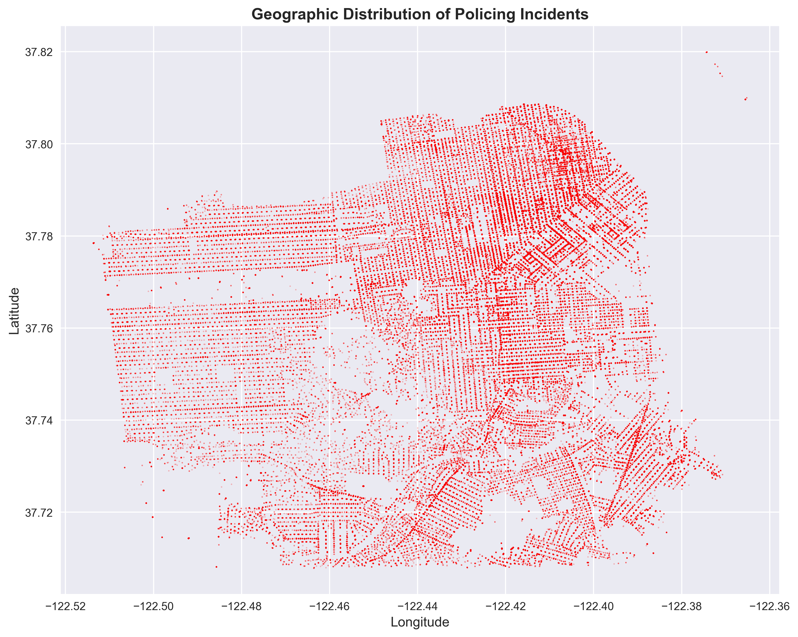
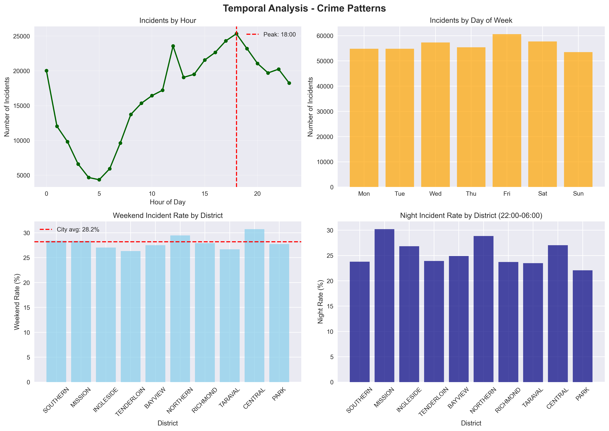
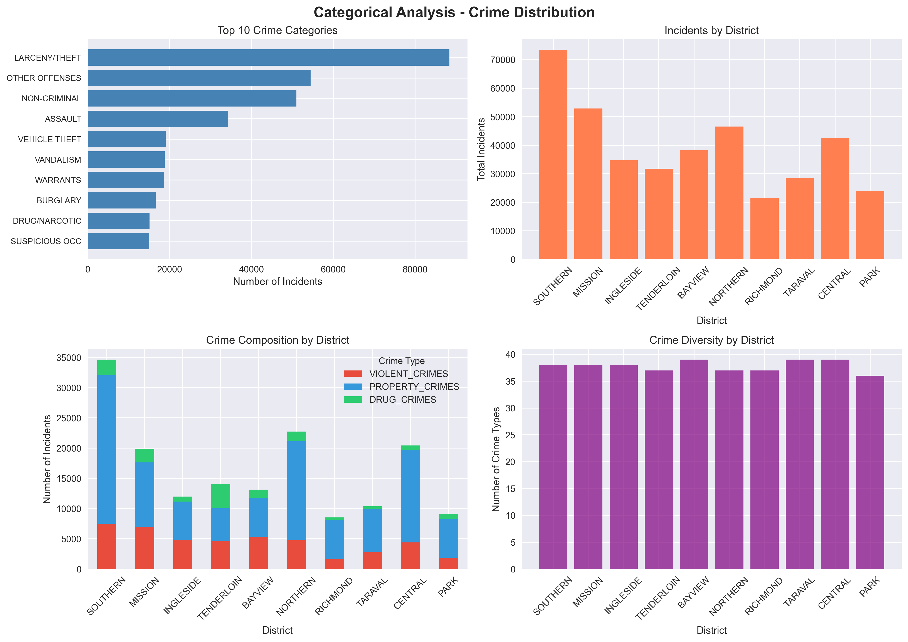

# Policing Pattern Analysis
### Unsupervised Machine Learning Approach to Understanding Police Activities

> **Author**: Giovanni Caggianella  
> **Matriculation Number**: 9215236  
> **Course**: DLBDSMLUSL01  
> **Date**: October 2025

---

## 📊 Project Overview

This project applies **unsupervised machine learning techniques** to analyze policing incident data from San Francisco (2012-2015). Using clustering algorithms and dimensionality reduction, we identify distinct patterns in police activities across different districts and uncover hidden structures in the data.

### Key Objectives
- Identify policing patterns across geographic districts
- Discover natural groupings in incident types and responses
- Analyze temporal and categorical trends
- Evaluate equity and resource allocation across districts

---

## 🎯 Methodology

### Data Analysis Pipeline
1. **Data Loading & Preprocessing**: Clean and standardize incident reports
2. **Feature Engineering**: Extract temporal, geographic, and categorical features
3. **Aggregation**: Group incidents by police district
4. **Dimensionality Reduction**: Apply PCA to reduce feature space
5. **Clustering**: K-Means and Hierarchical clustering
6. **Validation**: Silhouette analysis and dendrogram visualization
7. **Interpretation**: Analyze cluster characteristics and patterns

---

## 🔍 Key Results

### PCA & Clustering Analysis

The core of this analysis uses **Principal Component Analysis (PCA)** combined with **K-Means clustering** to reveal distinct policing patterns:



**Key Insights:**
- **5 distinct clusters** identified representing different policing profiles across 10 districts
- First two principal components capture **70.0%** of total variance (PC1=48.8%, PC2=21.2%)
- Three principal components capture **84.0%** of total variance (PC3=14.0%)
- Clear separation between high-activity and low-activity districts
- Optimal clustering determined by silhouette score of **0.338**
- Geographic and temporal factors strongly influence cluster formation

### Silhouette Analysis

To determine the optimal number of clusters, we performed silhouette analysis:



The silhouette score validates our choice of **5 clusters** (K=5, Silhouette=0.338), showing:
- Well-separated, cohesive clusters with highest silhouette score among tested configurations
- Optimal balance between cluster separation and cohesion
- Five distinct policing profiles across San Francisco districts

### Additional Visualizations

#### Geographic Distribution


#### Temporal Patterns


#### Categorical Analysis


---

## Dataset & Cluster Profiles

Analysis revealed **5 distinct clusters** with unique policing profiles:

#### **Cluster 0: Ultra-High Activity District**
- **Districts**: TENDERLOIN (1 district)
- **Profile**: Highest incident concentration
- **Characteristics**: Dense urban area with intensive policing needs

#### **Cluster 1: Moderate-High Activity Districts**
- **Districts**: INGLESIDE, BAYVIEW, TARAVAL (3 districts)
- **Profile**: Above-average incident volumes
- **Characteristics**: Residential areas with consistent policing patterns

#### **Cluster 2: High-Intensity District**
- **Districts**: SOUTHERN (1 district)
- **Profile**: High incident concentration in commercial/downtown area
- **Characteristics**: Business district with diverse incident types

#### **Cluster 3: High-Activity Urban Districts**
- **Districts**: MISSION, NORTHERN, CENTRAL (3 districts)
- **Profile**: Dense urban areas with high activity
- **Characteristics**: Mixed commercial/residential with elevated incident rates

#### **Cluster 4: Low-Activity Districts**
- **Districts**: RICHMOND, PARK (2 districts)
- **Profile**: Lowest incident volumes
- **Characteristics**: Residential areas with lower crime rates and policing intensity

### Key Statistical Metrics
- **Optimal K**: 5 clusters
- **Silhouette Score**: 0.338 (highest among K=2 to K=7)
- **PCA Variance Explained**: 70.0% (2D), 84.0% (3D)

---

## 🛠️ Technologies Used

- **Python 3.8+**
- **Pandas & NumPy**: Data manipulation
- **Scikit-learn**: Machine learning algorithms (PCA, K-Means, Hierarchical Clustering)
- **Matplotlib & Seaborn**: Data visualization
- **SciPy**: Statistical analysis and hierarchical clustering

---

## 📦 Installation

1. **Clone the repository**
   ```bash
   git clone https://github.com/GiovanniCaggianella/policing-pattern-analysis.git
   cd policing-pattern-analysis
   ```

2. **Install dependencies**
   ```bash
   pip install -r requirements.txt
   ```

3. **Run the analysis**
   ```bash
   python policing_equity_analysis.py
   ```

---

## 👤 Contact

**Giovanni Caggianella**  
Matriculation Number: 9215236  
Course: DLBDSMLUSL01 - Unsupervised Machine Learning

For questions please open an issue in this repository.

---

*Last updated: October 2025*
